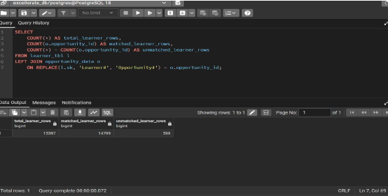
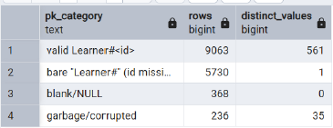

# Excelerate | Learner Opportunity Analysis
Analyzing learner sign-ups, applications, and completions for Excelerate using SQL and Looker Studio to identify learner drop-off points and uncover opportunities to improve overall outcomes.
[**Live Dashboard**](https://datastudio.google.com/reporting/eaa5661f-8f42-44c9-a769-ace0c079b084)

## Table of Contents

1. [Project Overview](#1-project-overview)
2. [Business Problem](#2-business-problem)
3. [Team Charter](#3-team-charter)
4. [Tools & Technologies](#4-tools--technologies)
5. [Dataset Overview](#5-dataset-overview)
6. [Analysis Approach](#6-analysis-approach)
7. [Exploratory Data Analysis](#7-exploratory-data-analysis-eda)
8. [Data Cleaning & Quality Improvements](#8-data-cleaning--quality-improvements)
9. [Data Analysis](#9-data-analysis)
10. [Dashboards](#10-dashboards)
11. [Key Insights](#11-key-insights)
12. [Recommendations](#12-recommendations)
13. [Conclusion](#13-conclusion)
14. [Project Contributions](#14-project-contributions)

## 1. Project Overview

Excelerate connects learners with growth opportunities such as internships, careers, competitions, courses, and masterclasses. This project analyzes learner and opportunity data to understand engagement, identify drop-off points, and determine how opportunity delivery can be improved.

### Objectives

- Profile learner engagement
- Identify drop-off points in the learner journey
- Guide opportunity matching

### Scope

- Learner and opportunity records
- Descriptive and trend analysis
- Dashboard-based reporting

### Success Metrics

- Clean and validated dataset
- Insights tied to key KPIs
- Actionable recommendations

## 2. Business Problem

Excelerate attracts strong participation, but it is unclear how many learners actually move forward after signing up. The analysis focuses on the following questions:

- Where in the funnel — sign-up → application → completion — do learners drop off?
- Which opportunities and categories lead to completion rather than just sign-ups?
- Why did sign-ups decline between Q4 2025 and Q1 2026?
- Which lead sources bring in learners who progress rather than only register?
- Are rewards and scholarships reaching learners who engage and complete?

## 3. Team Charter

### Team Mission

To deliver accurate, actionable insights on learner engagement and opportunity outcomes that help Excelerate connect more learners with the right opportunities.

### Team Values

**Accuracy · Collaboration · Clarity**

| Role | Team Member | Responsibility |
|---|---|---|
| Project Lead | Naheemat Akinyemi | Provides overall direction for the project, assigns tasks, and ensures the team stays aligned with project objectives |
| Team Lead | Ilqha Mabroor Gana Roushan | Guides the team's work, reviews progress, and ensures quality |
| Project Manager | Laiba Mir | Oversees the project, coordinates task timelines, and ensures deliverables are completed |
| Project Scribe | Omoze Ogwogho | Documents meetings, decisions, progress, and important project updates |

## 4. Tools & Technologies

| Tool | Purpose |
|---|---|
| SQL | Data profiling, joining, cleaning, type conversion, deduplication, and analysis |
| Looker Studio | Interactive dashboards, KPI cards, and reporting |
| PowerPoint | Final project [Presentation](./Excelerate%20Presentation.pptx)|

## 5. Dataset Overview

Two tables were profiled separately and then integrated using a `LEFT JOIN`.

| Table | Rows | Columns |
|---|---:|---:|
| opportunity_data | 5,733 | 33 |
| learner_tbl | 15,397 | 43 |
| Integrated dataset | 15,397 | 76 |

### Join Logic

`learner_tbl.sk = opportunity_data.opportunity_id`

The join was performed after normalising the `Learner#` / `Opportunity#` format. Learner-side records were retained.

**Time Span:** Approximately 4 years, based on `apply_date`.

## 6. Analysis Approach

| Step | Activity |
|---|---|
| 1. Clean Data & Define Objectives | Clean the data and define business questions, KPIs, and scope |
| 2. Collect & Prepare Data | Consolidate source files and standardise structure |
| 3. Explore Data | Profile distributions, identify gaps, outliers, and patterns |
| 4. Analyse & Segment | Compare trends and engagement drivers |
| 5. Visualise & Report | Build dashboards and translate findings into actions |

**Techniques Used:** Descriptive statistics · Segmentation · Trend analysis · Correlation analysis

## 7. Exploratory Data Analysis (EDA)

### 7.1 Opportunity Structure

The raw opportunity dataset contained **5,733 listings**.

| Finding | Detail |
|---|---|
| 46.7% Internship + Career | Internship (27.75%) and Career (18.98%) make up almost half of all listings |
| 78.8% No Fee | 4,518 of 5,733 opportunities charge no fee |
| 74.8% Duration in Weeks | Months, days, hours, minutes, and years also appeared and required standardisation |
| Fee Outliers | A small number of extreme values existed, including one corrupted value of `$6,000,000,000,000` |
| Corrupted Listings | 3 of 5,733 raw records (0.03%) contained leaked UI/form-configuration content |

### 7.2 Participation

Different metrics use different denominators:

- **Completion:** Completed ÷ application-bearing records
- **Paid Conversion:** Uses only records with a payment status. There were 8,529 unpaid and 6,363 paid records; blanks were not counted as unpaid.
- **Application Stage:** 10.76% of records contained a value in `application_id`. Because the field includes question responses and placeholders rather than reliable IDs, it was treated as an indicator of application-stage progression rather than a row key.

## 8. Data Cleaning & Quality Improvements

All cleaning was performed in SQL.

### 8.1 Integrity & Identifiers

| Issue | What Was Found | Treatment |
|---|---|---|
| Learner PK | 5,730 of 15,397 records (37.2%) were linked to a distinct learner PK containing only a bare `Learner#` value. 368 records had blank learner IDs and 236 contained corrupted values such as Base64 or JSON fragments. | `sk` was used independently of damaged `pk`. The 5,730 bare-ID rows, 368 blank rows, and 236 corrupted rows were removed as unrecoverable. |
| Unmatched Join | 598 learner records had no opportunity match. | These matched the records removed during identifier cleaning. This is a data-quality finding, not proof of non-applicants. |
| Exact Duplicates | 538 of 15,397 rows (3.5%) were identical across all 76 columns. | Deduplicated to retain one copy and audited separately. |
| `application_id` | Populated in 1,657 rows (10.76%) with only 248 distinct values. The field included essay text and placeholders such as `111111`. | Not used as a row key. Application metrics use only rows with a usable value, with limitations noted. |
| Duration | 139 records across 15 opportunities had a duration exceeding 4 years. | Flagged as errors and removed. |
| Role (Test) | 447 records across 112 opportunities had a role containing `"test"`. | Flagged as test records and removed from analysis. 

### 8.2 Types, Nulls & Categories

| Issue | What Was Found | Treatment |
|---|---|---|
| Text-Typed Columns | All 76 columns were stored as text; `AVG(fee)` failed with `avg(text) does not exist`. | Explicit type conversion was applied and fee values were validated to a usable range. |
| Literal `"null"` | `"null"`, `"Null"`, and `"NULL"` appeared in 3,720 integrated location rows and 466 opportunity rows. | Converted to true SQL `NULL`. |
| Inconsistent Categories | Location had 23 spellings; `duration_type` contained variations such as week/weeks, month/months, `da`, and `yearssss`; currencies included EUR and EURO. | Location was reduced to 3 values, duration to six standard units, and EURO was mapped to EUR. |
| Export Corruption | 10–12 records across both tables contained leaked JSON/form-configuration text. | Flagged and quarantined rather than reconstructed. |
| Fee / Category Mismatch | Approximately 9,050 apparent mismatches were found across 14,799 matched rows. Learner-side values were blank in 62.7%; only 5 were genuine conflicts. | Opportunity-side values were treated as authoritative; the 5 conflicts were retained for review. |

### 8.3 What the Cleaned Data Guarantees

- **Analysis-ready types:** Text dates, numbers, and categories were converted.
- **Reliable records:** Blank, corrupted, and duplicate rows were excluded.
- **Consistent missing values:** Text `"null"` values were converted to real SQL `NULL`.
- **Clean categories:** Spellings, units, and labels were standardised.
- **No double counting:** Scholarship and reward values were normalised per opportunity.
- **Correct populations:** Sign-ups were kept separate from applications, with a minimum of 5 applications used for opportunity comparisons.

### 8.4 Net Effect of Cleaning

**15,397 → 8,482 rows**

A total of **6,915 rows were removed** through the identifier criteria, test-role filtering, and duration filtering. The 538 duplicate records were audited separately and are not counted as an additional 538 removals unless removed during the final deduplication step.

| Metric | Before | After |
|---|---:|---:|
| Total Rows | 15,397 | 8,482 |
| Blank Identifier Rows | 368 | 0 |
| Corrupted Identifier Rows | 236 | 0 |
| Literal `"null"` Locations | 3,720 | 0 |
| Location Spellings | 23 | 3 |
| `COUNT(DISTINCT pk)` | 597 | 551 |
| `COUNT(DISTINCT opportunity_id)` | 5,733 | 3,045 |

## 9. Data Analysis

After cleaning, the data was segmented and analysed in SQL and Looker Studio across five areas.

| Analysis Area | Question Answered |
|---|---|
| Funnel Analysis | How many sign-ups become applications, and how many applications are completed? |
| Opportunity Ranking | Which categories and opportunities drive sign-ups versus completion? |
| Trend Analysis | How do sign-ups and applications change by month and quarter? |
| Lead-Source Analysis | Which acquisition channels bring in learners who progress? |
| Incentive Analysis | How are scholarships and rewards distributed across categories, currencies, and opportunities? |

### Key Metrics

| Metric | Value |
|---|---:|
| Sign-ups | 8.5K |
| Applications (application-stage records) | 1,564 |
| Learners | 551 |
| Applications Completed | ~7% |
| Sign-up Change, Q4 2025 → Q1 2026 | −33.94% |
| Acceptance Rate | 90.8% |
| Rejected Sign-ups | 215 |
| Opportunity Completion Rate | 23.1% |
| Scholarship Opportunities | 2,729 |
| Scholarship Value | 560.5K |
| Rewards | 3,755 |
| Paid Conversion | 5.65% |

## 10. Dashboards

**[Open the Full Interactive Dashboard in Looker Studio](https://datastudio.google.com/reporting/eaa5661f-8f42-44c9-a769-ace0c079b084)**

### Dashboard Objectives

The dashboards were built to track opportunity sign-up performance and answer the following questions:

### What the Dashboard Answers
- How many learners signed up for opportunities?
- How many learners progressed from sign-up to application?
- What percentage of applications were completed?
- Where are learners dropping off in the opportunity journey?
- Which opportunities attract the most sign-ups?
- Which opportunities have the highest completion rates?
- How do sign-ups and completions change over time?
- Which categories and lead sources perform best?
- How are rewards distributed across opportunities?
- How does scholarship availability vary by opportunity category?
- What areas present the biggest opportunities for improving learner outcomes?

### Dashboard 1: Overview, Opportunity Rankings & Lead Source

- **KPI Cards:** 8.5K sign-ups, 1,564 applications, 551 learners, ~7% of applications completed, and a 33.94% decline in sign-ups from Q4 2025 to Q1 2026.
- **Conversion Trend:** Applications increase across the year while sign-ups spike and fall; the two measures do not move together.
- **Categories & Ranking:** Internship recorded 3,163 sign-ups with 10.36% completed. Competition recorded 1,083 of 1,564 applications. Course had 664 sign-ups but only 4 applications. Masterclass recorded 11.11% completion from 18 applications.
- **Lead Sources:** Social Media is the largest source but only ~7% completed, showing that volume does not necessarily translate to conversion.
- **Six-Month Momentum:** Sign-ups moved from 187 → 221 → 216 → 132 → 90 → 116 from November to April, with a December peak, March low, and April partial rebound.

### Dashboard 2: Sign-Up & Completion Performance

- **KPI Cards:** 90.8% acceptance rate, 215 rejected sign-ups, and 23.1% opportunity completion rate.
- **Sign-Up Extremes:** Trainee Internship drives the most sign-ups, while the lowest-sign-up opportunities are mostly test or placeholder records.
- **Highest Completion Rates:** The highest rates are led by small or test records, so completion rates should be interpreted alongside volume.
- **Lead Source Table:** Social Media recorded 3,626 sign-ups and 6.96% completed. Illinois Tech recorded 2,094 and 8.68%. Saint Louis Univ. recorded 614 and 8.78%. Google Search recorded 528 sign-ups and 0 applications.
- **Last 7 Days:** Application activity fell to zero on April 18–19 and returned to 7 on April 20.

### Dashboard 3: Rewards, Scholarships & Program

- **KPI Cards:** 2,729 scholarship opportunities, 560.5K scholarship value, 3,755 rewards, and 5.65% paid conversion.
- **Scholarship by Category:** Internship: 176.3K, Competition: 109.8K, Career: 86.4K, Course: 41.9K, and Job Simulation: 10.2K.
- **Top Opportunities:** Scholarship and reward leaders are different opportunities. Full Stack Web Dev leads scholarships at 50K, while Internship Automation leads rewards at 16.3.
- **Value Distribution:** Most scholarship records fall within the 101–200 band, with approximately 2.1K records; 316 have zero value.
- **Currency & Duration:** USD accounts for 76.6%, EUR 13.7%, and INR 9.7%. Most categories have an average duration of 21–25 weeks.

## 11. Key Insights

### 1. High Participation Does Not Translate Into Progression

Only **1,564 application-stage records** were identified and approximately **7% completed**, showing a significant loss of movement across the funnel.

### 2. Opportunity Volume Does Not Equal Effectiveness

Internship and other high-volume opportunities attract many learners, but sign-up volume does not consistently translate into completion.

### 3. Participation Is Declining and Fluctuating

Sign-ups declined by **33.94% from Q4 2025 to Q1 2026**, while monthly activity also showed significant fluctuations.

### 4. Lead-Source Volume Is Not Lead-Source Effectiveness

Social Media generated the largest identifiable learner group, but downstream progression remained limited.

### 5. Rewards and Scholarships Are Not Clearly Aligned With Completion

The distribution of rewards and scholarships does not consistently match completion performance, suggesting that incentives may not be reaching the learners most likely to engage and complete.

## 12. Recommendations

### 1. Close the Funnel Gap
Track the full sign-up → application → completion journey and provide targeted support at the weakest step.

### 2. Rank Opportunities by Completion, Not Sign-Ups
Evaluate opportunities based on completion rate alongside volume, using a minimum-application threshold to avoid misleading results from small records.

### 3. Diagnose and Stabilise the Sign-Up Decline
Investigate the 33.94% decline from Q4 2025 to Q1 2026 and plan campaigns around monthly fluctuations.

### 4. Invest in Lead Sources by Conversion
Shift acquisition efforts toward lead sources that drive learner progression, not just high registration volumes.

### 5. Align Rewards and Scholarships With Outcomes
Review how incentives are distributed and pilot reward structures linked to learner engagement and completion.

## 13. Conclusion

This project provided a comprehensive view of the Excelerate learner journey, from initial sign-up through application and completion. By combining SQL-based analysis with Looker Studio dashboards, the project transformed raw learner and opportunity data into insights that can support better decision-making and opportunity management.

The analysis revealed a clear gap between learner interest and progression. While the platform recorded approximately 8.5K sign-ups, only 1,564 reached the application stage, with approximately 7% of applications completed. This indicates that generating learner interest is not the only challenge; improving movement through the funnel is equally important.

The analysis also showed that high sign-up volume does not always translate into strong completion outcomes. Some opportunities attracted large numbers of learners but recorded relatively low completion, while some opportunities with higher completion rates had very small volumes. This highlights the importance of evaluating opportunities using both volume and meaningful completion metrics rather than relying on sign-ups alone.

A decline of 33.94% in sign-ups from Q4 2025 to Q1 2026 was also identified, alongside noticeable fluctuations in monthly activity. Lead-source analysis further showed that the largest acquisition channels were not necessarily the most effective at driving learner progression. These findings suggest that future growth strategies should focus not only on attracting more learners but also on improving conversion and engagement at each stage of the journey.

Overall, the dashboards provide a practical foundation for monitoring learner behaviour, identifying drop-off points, comparing opportunity performance, and evaluating the relationship between acquisition, engagement, rewards, and scholarships. The recommendations developed from these findings can help Excelerate move toward a more data-driven approach to opportunity design, learner support, acquisition, and outcome improvement.

The project also strengthened the team's practical experience in data cleaning, SQL analysis, dashboard development, data storytelling, collaboration, and presenting insights to stakeholders.

## 14. Project Contributions

| Team Member | Contribution |
|---|---|
| **Laiba Mir** | EDA and data profiling |
| **Ilqha Mabroor Gana Roushan** | Looker Studio setup, data integration, and data cleaning |
| **Naheemat Akinyemi** | SQL environment setup, analysis, dashboard design, and presentation design |
| **Omoze Ogwogho** | Weekly report collation |
